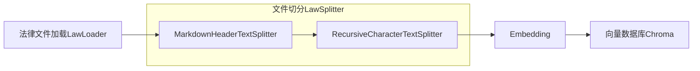
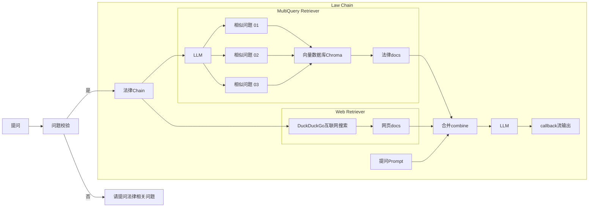

<div align="center">

# 项目修改记录

**修改者**: Kshqsz

</div>

---

## 📅 2025-12-09 更新

### 网页搜索功能修复

- 修复 DuckDuckGo 网页搜索功能
- 配置代理支持：`http://127.0.0.1:7890`
- 使用稳定的后端：优先 `html` 后端，自动降级到 `lite` 后端
- 添加随机延迟 (2-4秒) 避免触发 API 限速

**测试结果**：

```
查询: "中国民法典 合同"
✓ DuckDuckGo (html) 成功找到 3 条结果
- 《中华人民共和国民法典》第三编 合同
- 最高人民法院关于适用《中华人民共和国民法典》合同编通则若干问题的解释
- 中华人民共和国民法典--合同编
```

---

## 📅 2025-12-06 更新

### 1. 代码优化重构

- 重构 `law_ai/utils.py` - 优化 DashScopeEmbeddings 实现
- 重构 `law_ai/loader.py` - 改进文档加载逻辑
- 重构 `law_ai/splitter.py` - 优化文本分割器

### 2. 项目配置

- 删除 GitHub Actions 自动部署配置（原作者的服务器配置）
- 更新 `requirements.txt` 依赖

---

## 📅 2025-12-05 更新

**修改目的**: 将原项目从 OpenAI API 迁移到阿里云 DashScope（Qwen）API

### 1. API 适配修改

- **LLM 模型**: 从 `gpt-3.5-turbo` 改为 `qwen-max`（通过阿里云 DashScope OpenAI 兼容接口）
- **Embedding 模型**: 自定义实现 `DashScopeEmbeddings` 类，使用阿里云原生 `text-embedding-v2` 模型

### 2. 修改的文件

| 文件                | 修改内容                                                                                |
| ------------------- | --------------------------------------------------------------------------------------- |
| `law_ai/utils.py` | 新增 `DashScopeEmbeddings` 类，修改 `get_model()` 和 `get_embedding_model()` 函数 |
| `.env`            | 配置阿里云 DashScope API Key 和模型参数                                                 |

### 3. `.env` 配置示例

```env
# LLM 配置
OPENAI_API_KEY=sk-你的阿里云DashScope-API-Key
OPENAI_BASE_URL=https://dashscope.aliyuncs.com/compatible-mode/v1
MODEL_NAME=qwen-max

# Embedding 配置
EMBEDDING_MODEL=text-embedding-v2
```

---

## 遇到的问题及解决方案

### 问题: OpenAI 兼容层 Embedding 调用失败

**错误信息**: `InvalidRequestError: Value error, contents is neither str nor list of str`

**原因**: 旧版 `langchain` (0.1.x) 使用的 `openai` 库 (0.28.x) 与阿里云 DashScope 的 OpenAI 兼容接口不完全兼容。

**解决方案**: 使用阿里云官方 `dashscope` SDK，自定义实现 `DashScopeEmbeddings` 类，彻底绕过兼容性问题。

---

## 运行结果

- 向量数据库初始化成功，共导入个法律条文片段
- Web UI 运行正常
- 法律问答功能正常
  

---

## 我对 RAG 的理解

**RAG（检索增强生成）的核心流程：**

1. **法律条文预处理**: 法律条文被提前拆分成小段，存储到向量数据库。
2. **向量化**: Embedding 模型把这些段落以及用户的问题都转成向量。
3. **语义检索**: 向量数据库根据"语义相似度"找到最相关的法律条文段落。（可选：重排序模型再对这些段落进行排序，挑最最相关的）
4. **上下文注入**: 这些段落以文本的形式放进 LLM。
5. **生成回答**: LLM 根据 **用户问题 + 检索到的法律条文** 生成最终回答（相当于"开卷考试"）

**关于 Embedding 的两点补充：**

1. Embedding 看起来有理解能力，但这只是表面现象——它实际上就是一个**较为精准的向量转换器**。
2. Embedding 就像一个干翻译的，把中文问题和法律条文都翻译成"向量语言"（高维数值向量）；用户输入问题后，由**向量数据库使用内部算法**找到最为相近的条文。然后让LLM在开卷考试的情况下回答问题。

---

<div align="center">


[](https://www.gradio.app/)
[](https://twitter.com/billvsme)

</div>

法律AI助手
==========

基于 RAG（检索增强生成）技术的法律智能问答系统，融合本地法律知识库与互联网实时信息，利用大语言模型对用户提出的自然语言法律问题进行精准理解、知识检索与可靠回答。

## ✨ 功能特性

- 🔐 **用户认证系统** - 注册、登录、JWT Token 认证
- 💬 **对话历史管理** - 保存历史对话，随时查看和继续
- 📄 **文档上传** - 上传法律文档，AI 结合文档内容回答
- 📚 **法律条文引用** - 每个回答标注相关法律依据
- 🌐 **网络检索** - 结合 DuckDuckGo 搜索获取最新信息
- 🎨 **现代化界面** - 类似 ChatGPT 的交互体验

## 🏗️ 技术架构

| 层级 | 技术栈 |
|------|--------|
| 前端 | Streamlit |
| 后端 | FastAPI + SQLAlchemy |
| AI 模型 | Qwen (通义千问) via DashScope |
| 向量数据库 | ChromaDB |
| 网络检索 | DuckDuckGo |
| RAG 框架 | LangChain |

## 📁 项目结构

```
law-rag-assistant/
├── backend/                    # FastAPI 后端
│   ├── main.py                # 应用入口
│   ├── auth.py                # 认证模块
│   ├── database.py            # 数据库模型
│   ├── law_service.py         # 法律问答服务
│   ├── schemas.py             # Pydantic 模型
│   └── routers/               # API 路由
│       ├── auth.py            # 认证接口
│       ├── chat.py            # 聊天接口
│       ├── conversations.py   # 对话管理
│       └── documents.py       # 文档管理
├── frontend/                   # Streamlit 前端
│   ├── app.py                 # 前端入口
│   ├── api_client.py          # API 客户端
│   └── components.py          # UI 组件
├── law_ai/                     # RAG 核心模块
│   ├── chain.py               # RAG 链
│   ├── retriever.py           # 检索器
│   ├── prompt.py              # 提示词模板
│   ├── loader.py              # 文档加载
│   ├── splitter.py            # 文本分割
│   └── utils.py               # 工具函数
├── Law-Book/                   # 法律知识库
├── config.py                   # 配置文件
├── requirements.txt            # 依赖清单
├── start.sh                    # 一键启动脚本
├── start_backend.sh            # 启动后端
└── start_frontend.sh           # 启动前端
```

## 🚀 快速开始

### 1. 环境准备

```bash
# 创建虚拟环境
python -m venv venv311
source venv311/bin/activate

# 安装依赖
pip install -r requirements.txt
```

### 2. 配置环境变量

```bash
# 复制环境变量示例
cp .env.example .env

# 编辑 .env 文件，填入你的 DashScope API Key
vim .env
```

`.env` 配置示例：

```env
OPENAI_API_KEY=sk-你的阿里云DashScope-API-Key
OPENAI_BASE_URL=https://dashscope.aliyuncs.com/compatible-mode/v1
MODEL_NAME=qwen-plus
EMBEDDING_MODEL=text-embedding-v2
SECRET_KEY=your-jwt-secret-key
```

### 3. 初始化向量数据库

```bash
# 加载法律文档并建立向量索引
python manager.py --init
```

### 4. 启动服务

**一键启动（推荐）：**

```bash
./start.sh
```

**分别启动：**

```bash
# 终端 1：启动后端
./start_backend.sh

# 终端 2：启动前端
./start_frontend.sh
```

### 5. 访问系统

- 🌐 **前端界面**: http://localhost:8501
- 📚 **API 文档**: http://localhost:8000/api/docs
- 🔧 **API ReDoc**: http://localhost:8000/api/redoc

## 📖 使用说明

### 注册与登录

1. 打开前端界面 http://localhost:8501
2. 在注册页面创建账号
3. 登录后即可开始使用

### 法律问答

1. 在输入框中输入法律问题
2. AI 会结合法律知识库和网络搜索给出回答
3. 回答会附带法律依据和网络来源

### 文档分析

1. 在侧边栏上传法律文档（支持 .txt, .md, .pdf, .doc, .docx）
2. 选中文档后提问
3. AI 会结合文档内容回答问题

## 🔧 配置说明

编辑 `config.py` 修改配置：

| 配置项 | 说明 | 默认值 |
|--------|------|--------|
| LAW_BOOK_CHUNK_SIZE | 文本分块大小 | 100 |
| LAW_BOOK_CHUNK_OVERLAP | 分块重叠字符数 | 20 |
| LAW_VS_SEARCH_K | 返回的法律条文数量 | 2 |
| WEB_VS_SEARCH_K | 返回的网页数量 | 2 |
| WEB_PROXY | 网络代理（可选） | http://127.0.0.1:7890 |

## 🔌 API 接口

### 认证接口

| 方法 | 路径 | 说明 |
|------|------|------|
| POST | /api/auth/register | 用户注册 |
| POST | /api/auth/login | 用户登录 |
| GET | /api/auth/me | 获取当前用户 |

### 对话接口

| 方法 | 路径 | 说明 |
|------|------|------|
| GET | /api/conversations | 获取对话列表 |
| POST | /api/conversations | 创建新对话 |
| DELETE | /api/conversations/{id} | 删除对话 |
| GET | /api/conversations/{id}/messages | 获取对话消息 |

### 聊天接口

| 方法 | 路径 | 说明 |
|------|------|------|
| POST | /api/chat | 发送消息并获取回答 |
| POST | /api/chat/stream | 流式发送消息 |

### 文档接口

| 方法 | 路径 | 说明 |
|------|------|------|
| POST | /api/documents/upload | 上传文档 |
| GET | /api/documents | 获取文档列表 |
| DELETE | /api/documents/{id} | 删除文档 |

## Demo

[https://law.vmaig.com/](https://law.vmaig.com/)

**用户名**: username
**密码**:  password

## 原理

基于langchain链式调用，先按条切分法律条文，导入向量数据Chroma。
问答相关问题时，先通过相似度搜索向量数据，获取相关法律条文，然后通过DuckDuckGo互联网搜索相关网页，然后合并法律条文和网页内容，对问题进行回答。

**初始化init**



**提问流程**



## 旧版 Gradio 界面

如果你想使用旧版 Gradio 界面，可以运行：

```bash
python manager.py --web
```

默认用户名/密码: username / password

## 运行对话

```
python manager.py --shell
```

## 🔄 连续对话功能

系统现已支持**连续对话**功能，AI律师可以理解上下文并回答追问。

### ✨ 核心特性

- **上下文理解**：AI能理解"它"、"这个"、"那"等代词指代
- **多轮追问**：支持3-5轮连续对话，保持话题连贯
- **智能切换**：新话题不受旧话题干扰
- **自动管理**：系统自动获取和传递历史消息（最近10条）

### 📝 使用示例

**第一轮**:
```
👤 用户: 故意杀人罪会判几年？
⚖️  律师: 根据《刑法》第232条，故意杀人的，处死刑、无期徒刑或者十年以上有期徒刑...
```

**第二轮（使用代词追问）**:
```
👤 用户: 那如果是过失致人死亡呢？
⚖️  律师: 过失致人死亡罪与故意杀人罪不同，根据《刑法》第233条...
```

**第三轮（指代上文）**:
```
👤 用户: 这两种情况的主要区别是什么？
⚖️  律师: 故意杀人罪和过失致人死亡罪的主要区别在于主观方面...
```

### 🔍 技术实现

1. **新增提示词模板** (`law_ai/prompt.py`)
   - 添加了 `LAW_PROMPT_WITH_HISTORY` 模板
   - 支持传入历史对话上下文

2. **服务层支持历史** (`backend/law_service.py`)
   ```python
   async def ask_question(
       question: str,
       use_document_content: Optional[str] = None,
       history: Optional[list] = None  # 新增参数
   )
   ```

3. **API路由传递历史** (`backend/routers/chat.py`)
   - 自动获取当前对话的最近10条消息（5轮对话）
   - 格式化为 `[{"role": "user", "content": "..."}, ...]`
   - 传递给 law_service

4. **Chain链处理历史** (`law_ai/chain.py`)
   - 根据是否有历史选择不同的 Prompt
   - 将历史格式化为"用户: ... 律师: ..."形式
   - 传递给大模型进行推理

### 🧪 测试方法

**方法1: 运行测试脚本**
```bash
python test_continuous_chat.py
```

测试脚本会执行4轮对话：
- 独立问题（无历史）
- 使用代词追问（测试上下文理解）
- 继续深入追问（测试多轮对话）
- 切换新话题（测试话题切换能力）

**方法2: 前端测试**
1. 启动服务（`./start.sh`）
2. 在浏览器中进行多轮对话测试

### ⚙️ 配置说明

- **历史消息数量**：默认保留最近10条消息（5轮对话）
- **修改历史长度**：编辑 `backend/routers/chat.py` 中的 `.limit(10)`
- **历史格式**：自动格式化为"用户: ... 律师: ..."形式

### ✅ 验证要点

- ✅ 代词理解：能正确识别"它"、"这个"、"那"的指代
- ✅ 多轮追问：3-5轮对话中保持话题连贯
- ✅ 话题切换：新话题不受旧话题干扰
- ✅ 信息整合：能综合历史和新检索结果回答
- ✅ 准确性：不因历史对话产生幻觉或错误
