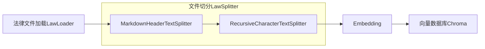
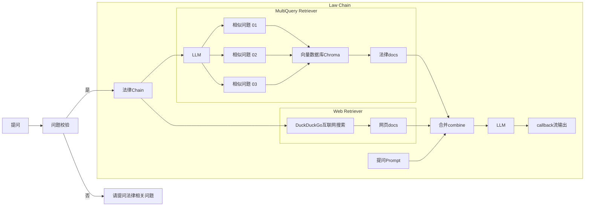

<div align="center">

# 项目修改记录

**修改者**: Kshqsz

</div>

---

## 📅 2025-12-09 更新

### 网页搜索功能修复

- 修复 DuckDuckGo 网页搜索功能
- 配置代理支持：`http://127.0.0.1:7890`
- 使用稳定的后端：优先 `html` 后端，自动降级到 `lite` 后端
- 添加随机延迟 (2-4秒) 避免触发 API 限速

**测试结果**：

```
查询: "中国民法典 合同"
✓ DuckDuckGo (html) 成功找到 3 条结果
- 《中华人民共和国民法典》第三编 合同
- 最高人民法院关于适用《中华人民共和国民法典》合同编通则若干问题的解释
- 中华人民共和国民法典--合同编
```

---

## 📅 2025-12-06 更新

### 1. 代码优化重构

- 重构 `law_ai/utils.py` - 优化 DashScopeEmbeddings 实现
- 重构 `law_ai/loader.py` - 改进文档加载逻辑
- 重构 `law_ai/splitter.py` - 优化文本分割器

### 2. 项目配置

- 删除 GitHub Actions 自动部署配置（原作者的服务器配置）
- 更新 `requirements.txt` 依赖

---

## 📅 2025-12-05 更新

**修改目的**: 将原项目从 OpenAI API 迁移到阿里云 DashScope（Qwen）API

### 1. API 适配修改

- **LLM 模型**: 从 `gpt-3.5-turbo` 改为 `qwen-max`（通过阿里云 DashScope OpenAI 兼容接口）
- **Embedding 模型**: 自定义实现 `DashScopeEmbeddings` 类，使用阿里云原生 `text-embedding-v2` 模型

### 2. 修改的文件

| 文件                | 修改内容                                                                                |
| ------------------- | --------------------------------------------------------------------------------------- |
| `law_ai/utils.py` | 新增 `DashScopeEmbeddings` 类，修改 `get_model()` 和 `get_embedding_model()` 函数 |
| `.env`            | 配置阿里云 DashScope API Key 和模型参数                                                 |

### 3. `.env` 配置示例

```env
# LLM 配置
OPENAI_API_KEY=sk-你的阿里云DashScope-API-Key
OPENAI_BASE_URL=https://dashscope.aliyuncs.com/compatible-mode/v1
MODEL_NAME=qwen-max

# Embedding 配置
EMBEDDING_MODEL=text-embedding-v2
```

---

## 遇到的问题及解决方案

### 问题: OpenAI 兼容层 Embedding 调用失败

**错误信息**: `InvalidRequestError: Value error, contents is neither str nor list of str`

**原因**: 旧版 `langchain` (0.1.x) 使用的 `openai` 库 (0.28.x) 与阿里云 DashScope 的 OpenAI 兼容接口不完全兼容。

**解决方案**: 使用阿里云官方 `dashscope` SDK，自定义实现 `DashScopeEmbeddings` 类，彻底绕过兼容性问题。

---

## 运行结果

- 向量数据库初始化成功，共导入个法律条文片段
- Web UI 运行正常
- 法律问答功能正常
  

---

## 我对 RAG 的理解

**RAG（检索增强生成）的核心流程：**

1. **法律条文预处理**: 法律条文被提前拆分成小段，存储到向量数据库。
2. **向量化**: Embedding 模型把这些段落以及用户的问题都转成向量。
3. **语义检索**: 向量数据库根据"语义相似度"找到最相关的法律条文段落。（可选：重排序模型再对这些段落进行排序，挑最最相关的）
4. **上下文注入**: 这些段落以文本的形式放进 LLM。
5. **生成回答**: LLM 根据 **用户问题 + 检索到的法律条文** 生成最终回答（相当于"开卷考试"）

**关于 Embedding 的两点补充：**

1. Embedding 看起来有理解能力，但这只是表面现象——它实际上就是一个**较为精准的向量转换器**。
2. Embedding 就像一个干翻译的，把中文问题和法律条文都翻译成"向量语言"（高维数值向量）；用户输入问题后，由**向量数据库使用内部算法**找到最为相近的条文。然后让LLM在开卷考试的情况下回答问题。

---

<div align="center">


[](https://streamlit.io/)
[](https://fastapi.tiangolo.com/)
[](https://python.langchain.com/)
[](https://dashscope.aliyun.com/)

</div>

# 法律AI助手

<div align="center">

**基于 RAG（检索增强生成）技术的智能法律问答系统**

融合本地法律知识库与互联网实时信息  
利用大语言模型对法律问题进行精准理解、知识检索与可靠回答

[快速开始](#-快速开始) · [功能特性](#-功能特性) · [使用指南](#-使用说明) · [管理后台](#-管理员后台) · [API文档](#-api-接口)

</div>

---

## ✨ 功能特性

### 用户端功能

- 🔐 **用户认证系统** - 完整的注册、登录、JWT Token 认证机制
- 💬 **连续对话支持** - AI理解上下文，支持代词指代和多轮追问
- 📄 **文档上传分析** - 上传法律文档，AI结合文档内容精准回答
- 📚 **法律条文引用** - 每个回答标注相关法律依据，来源可追溯
- 🌐 **实时网络检索** - 结合DuckDuckGo搜索获取最新法律信息
- ⭐ **收藏夹管理** - 收藏重要对话，随时查看和导出
- 📥 **PDF导出** - 将对话导出为PDF文件，便于保存和分享
- 📜 **历史对话** - 保存所有对话记录，支持继续历史对话
- 🎨 **现代化界面** - 类似ChatGPT的深色主题交互体验

### 管理员后台

- 📊 **数据统计面板** - 用户数、对话数、问题数实时统计
- 📈 **数据可视化** - ECharts图表展示数据趋势和分布
- 🔥 **高频问题分析** - 智能提取热门法律问题，支持主题归类
- 📂 **法律分类统计** - 按9大法律类别统计问题分布
- 📅 **问题增长趋势** - 时间序列图展示提问量变化
- 👥 **用户活跃度** - 用户提问次数排行和活跃度分析

## 🏗️ 技术架构

### 核心技术栈

| 层级 | 技术栈 | 说明 |
|------|--------|------|
| 🎨 用户前端 | Streamlit 1.28+ | 用户对话界面 (端口 8501) |
| 👑 管理后台 | Streamlit + ECharts | 数据统计和可视化 (端口 8502) |
| ⚡ 后端 | FastAPI + SQLAlchemy | RESTful API 服务 (端口 8000) |
| 🤖 LLM | Qwen (通义千问) | DashScope API |
| 📝 Embedding | text-embedding-v2 | 阿里云向量模型 |
| 🗄️ 向量数据库 | ChromaDB | 法律文档向量存储 |
| 🔍 网络检索 | DuckDuckGo | 实时法律信息搜索 |
| 🔗 RAG框架 | LangChain 0.1.1 | 检索增强生成 |
| 💾 数据库 | SQLite | 用户和对话数据 |
| 🔐 认证 | JWT | Token认证机制 |

### 系统架构图

```
┌─────────────────────────────────────────────────────────┐
│                      用户层                              │
├──────────────────┬──────────────────┬──────────────────┤
│  用户前端 :8501   │  管理后台 :8502   │  API文档 :8000  │
│  (Streamlit)     │  (Streamlit)     │  (Swagger)      │
└──────────────────┴──────────────────┴──────────────────┘
                            │
                            ▼
┌─────────────────────────────────────────────────────────┐
│                   后端服务层 (FastAPI)                   │
├─────────────────┬────────────────┬─────────────────────┤
│  认证服务       │  对话服务       │  文档服务            │
│  (JWT)          │  (LawService)  │  (Upload)           │
└─────────────────┴────────────────┴─────────────────────┘
                            │
                            ▼
┌─────────────────────────────────────────────────────────┐
│                   RAG核心层 (LangChain)                  │
├─────────────────┬────────────────┬─────────────────────┤
│  向量检索       │  网络搜索       │  问题重写            │
│  (ChromaDB)     │  (DuckDuckGo)  │  (LLM)              │
└─────────────────┴────────────────┴─────────────────────┘
                            │
                            ▼
┌─────────────────────────────────────────────────────────┐
│                   模型层 (Qwen)                          │
├─────────────────┬────────────────┬─────────────────────┤
│  Qwen-max       │  Embedding     │  向量库              │
│  (生成)         │  (检索)         │  (10000+条文)       │
└─────────────────┴────────────────┴─────────────────────┘
```

## 📁 项目结构

```
law-rag-assistant/
├── backend/                    # FastAPI 后端
│   ├── main.py                # 应用入口
│   ├── auth.py                # 认证模块
│   ├── database.py            # 数据库模型
│   ├── law_service.py         # 法律问答服务
│   ├── schemas.py             # Pydantic 模型
│   └── routers/               # API 路由
│       ├── auth.py            # 认证接口
│       ├── chat.py            # 聊天接口
│       ├── conversations.py   # 对话管理
│       └── documents.py       # 文档管理
├── frontend/                   # Streamlit 前端
│   ├── app.py                 # 前端入口
│   ├── api_client.py          # API 客户端
│   └── components.py          # UI 组件
├── law_ai/                     # RAG 核心模块
│   ├── chain.py               # RAG 链
│   ├── retriever.py           # 检索器
│   ├── prompt.py              # 提示词模板
│   ├── loader.py              # 文档加载
│   ├── splitter.py            # 文本分割
│   └── utils.py               # 工具函数
├── Law-Book/                   # 法律知识库
├── config.py                   # 配置文件
├── requirements.txt            # 依赖清单
├── start.sh                    # 一键启动脚本
├── start_backend.sh            # 启动后端
└── start_frontend.sh           # 启动前端
```

## 🚀 快速开始

### 1. 环境准备

```bash
# 克隆项目
git clone <repository-url>
cd law-rag-assistant

# 创建虚拟环境
python -m venv venv311
source venv311/bin/activate  # Windows: venv311\Scripts\activate

# 安装依赖
pip install -r requirements.txt
```

### 2. 配置环境变量

创建 `.env` 文件并配置以下内容：

```env
# ========== DashScope API 配置 ==========
OPENAI_API_KEY=sk-你的阿里云DashScope-API-Key
OPENAI_BASE_URL=https://dashscope.aliyuncs.com/compatible-mode/v1
MODEL_NAME=qwen-max
EMBEDDING_MODEL=text-embedding-v2

# ========== JWT 认证配置 ==========
SECRET_KEY=your-secret-key-change-in-production
ALGORITHM=HS256
ACCESS_TOKEN_EXPIRE_MINUTES=30

# ========== 代理配置（可选）==========
# 用于DuckDuckGo网络搜索，无代理可删除此项
WEB_PROXY=http://127.0.0.1:7890
```

> 💡 **获取 DashScope API Key**：访问 [阿里云DashScope控制台](https://dashscope.console.aliyun.com/) 注册并获取 API Key

### 3. 初始化数据库

```bash
# 初始化向量数据库（加载法律文档）
python manager.py --init

# 创建管理员账号
python init_admin.py
```

初始化过程会：
- 加载 `Law-Book/` 目录下的所有法律文档
- 对文档进行分块处理
- 生成向量并存储到 ChromaDB
- 创建管理员账号（用户名：admin，密码：admin123）

### 4. 启动服务

#### 方式一：一键启动（推荐）

```bash
./start.sh
```

该脚本会自动启动：
- 后端 API 服务 (http://localhost:8000)
- 用户前端界面 (http://localhost:8501)
- 管理员后台 (http://localhost:8502)

#### 方式二：分别启动

```bash
# 终端 1：启动后端 API
./start_backend.sh

# 终端 2：启动用户前端
./start_frontend.sh

# 终端 3：启动管理员后台（可选）
./start_admin.sh
```

### 5. 访问系统

| 服务 | 地址 | 说明 |
|------|------|------|
| 👤 用户前端 | http://localhost:8501 | 注册、登录、对话 |
| 👑 管理后台 | http://localhost:8502 | 数据统计（需管理员账号）|
| 📚 API 文档 | http://localhost:8000/api/docs | Swagger 接口文档 |
| 🔧 ReDoc | http://localhost:8000/api/redoc | 更美观的文档视图 |

## 📖 使用说明

### 用户端使用

#### 1. 注册与登录

1. 访问 http://localhost:8501
2. 点击"注册"创建账号
3. 使用账号密码登录系统

#### 2. 基础对话

在输入框中输入法律问题，例如：
- "故意杀人罪会判几年？"
- "合同违约需要承担什么责任？"
- "什么是民事诉讼时效？"

系统会：
- ✅ 从法律知识库检索相关条文
- ✅ 从网络搜索最新信息
- ✅ 生成专业的法律回答
- ✅ 标注法律依据和来源

#### 3. 连续对话

系统支持多轮连续对话，能理解上下文：

```
用户：故意杀人罪会判几年？
AI：根据《刑法》第232条...

用户：那如果是过失致人死亡呢？  ← 使用代词"那"
AI：过失致人死亡罪与故意杀人罪不同...

用户：这两种情况的主要区别是什么？  ← 指代上文
AI：主要区别在于主观方面...
```

特性：
- 🔄 自动保存最近10条消息（5轮对话）
- 🎯 理解代词指代（它、这个、那、这些等）
- 🔍 智能问题重写，提高检索准确度
- 🌟 新话题自动识别，不受旧话题干扰

#### 4. 文档上传分析

1. 点击侧边栏"上传文档"
2. 选择文档（支持 .txt, .md, .pdf, .doc, .docx）
3. 选中文档后提问
4. AI会结合文档内容和法律知识库回答

适用场景：
- 分析合同条款
- 解读法律文书
- 审查协议内容

#### 5. 收藏与导出

- ⭐ **收藏对话**：点击对话右上角的星标图标
- 📥 **导出PDF**：在收藏夹中选择对话，点击"导出PDF"
- 📜 **查看历史**：在侧边栏查看所有历史对话

### 管理员后台使用

#### 1. 登录后台

1. 访问 http://localhost:8502
2. 使用管理员账号登录（默认：admin / admin123）

#### 2. 数据统计

管理后台提供以下统计功能：

**基础统计卡片**
- 👥 总用户数
- 💬 对话总数
- ❓ 问题总数
- 📊 平均每用户问题数

**可视化图表（ECharts）**
- 📈 **问题数量增长趋势**：按日期统计每天的提问量
- 🔥 **高频问题Top10**：智能提取热门法律问题
  - 支持主题归一化（如"杀人"归类为"故意杀人罪"）
  - 区分标准法律主题和其他高频问题
  - 显示分类标签（刑法、民法、行政法等）
- 📂 **法律分类分布**：按9大法律类别统计问题分布
  - 宪法、宪法相关法、民法典、民法商法
  - 行政法、经济法、社会法、刑法
  - 诉讼与非诉讼程序法

#### 3. 用户管理

- 查看所有注册用户
- 查看用户提问次数
- 分析用户活跃度

## 🔧 配置说明

### config.py 配置项

| 配置项 | 说明 | 默认值 | 备注 |
|--------|------|--------|------|
| LAW_BOOK_PATH | 法律文档路径 | ./Law-Book | 存放法律条文的目录 |
| LAW_BOOK_CHUNK_SIZE | 文本分块大小 | 100 | 每块最大字符数 |
| LAW_BOOK_CHUNK_OVERLAP | 分块重叠字符数 | 20 | 防止语义割裂 |
| LAW_VS_SEARCH_K | 返回的法律条文数量 | 10 | 向量检索返回条数 |
| WEB_VS_SEARCH_K | 返回的网页数量 | 5 | DuckDuckGo搜索结果数 |
| WEB_PROXY | 网络代理 | http://127.0.0.1:7890 | 可选，用于网络搜索 |
| WEB_HOST | Web服务监听地址 | 0.0.0.0 | Gradio旧版UI地址 |
| WEB_PORT | Web服务端口 | 7860 | Gradio旧版UI端口 |

### 环境变量说明

```env
# ========== LLM配置 ==========
OPENAI_API_KEY=sk-xxx              # DashScope API Key（必需）
OPENAI_BASE_URL=https://...       # DashScope兼容接口（必需）
MODEL_NAME=qwen-max                # 使用的模型（推荐qwen-max）

# ========== Embedding配置 ==========
EMBEDDING_MODEL=text-embedding-v2  # 向量模型

# ========== 认证配置 ==========
SECRET_KEY=xxx                     # JWT密钥（生产环境必须修改）
ALGORITHM=HS256                    # JWT算法
ACCESS_TOKEN_EXPIRE_MINUTES=30     # Token过期时间

# ========== 代理配置 ==========
WEB_PROXY=http://127.0.0.1:7890   # 可选，用于网络搜索
```

### 法律知识库结构

`Law-Book/` 目录按照9大法律类别组织：

```
Law-Book/
├── 1-宪法/
├── 2-宪法相关法/
├── 3-民法典/
├── 3-民法商法/
├── 4-行政法/
├── 5-经济法/
├── 6-社会法/
├── 7-刑法/
└── 8-诉讼与非诉讼程序法/
```

每个文件为单独的法律条文，使用Markdown格式。

## 🔌 API 接口

完整的 RESTful API 接口，支持第三方集成。访问 http://localhost:8000/api/docs 查看交互式文档。

### 认证接口

| 方法 | 路径 | 说明 | 认证 |
|------|------|------|------|
| POST | /api/auth/register | 用户注册 | ❌ |
| POST | /api/auth/login | 用户登录 | ❌ |
| GET | /api/auth/me | 获取当前用户信息 | ✅ |

### 对话接口

| 方法 | 路径 | 说明 | 认证 |
|------|------|------|------|
| GET | /api/conversations | 获取对话列表 | ✅ |
| POST | /api/conversations | 创建新对话 | ✅ |
| DELETE | /api/conversations/{id} | 删除对话 | ✅ |
| GET | /api/conversations/{id}/messages | 获取对话消息 | ✅ |

### 聊天接口

| 方法 | 路径 | 说明 | 认证 |
|------|------|------|------|
| POST | /api/chat | 发送消息（同步） | ✅ |
| POST | /api/chat/stream | 发送消息（流式）| ✅ |
| GET | /api/chat/check-law | 检查问题是否与法律相关 | ✅ |

### 文档接口

| 方法 | 路径 | 说明 | 认证 |
|------|------|------|------|
| POST | /api/documents/upload | 上传文档 | ✅ |
| GET | /api/documents | 获取文档列表 | ✅ |
| DELETE | /api/documents/{id} | 删除文档 | ✅ |

### 收藏接口

| 方法 | 路径 | 说明 | 认证 |
|------|------|------|------|
| GET | /api/favorites | 获取收藏列表 | ✅ |
| POST | /api/favorites | 添加收藏 | ✅ |
| DELETE | /api/favorites/{id} | 取消收藏 | ✅ |

### 管理员接口

| 方法 | 路径 | 说明 | 认证 |
|------|------|------|------|
| GET | /api/admin/stats | 获取统计数据 | ✅ 管理员 |
| GET | /api/admin/questions | 获取所有问题 | ✅ 管理员 |

### 请求示例

**用户注册**
```bash
curl -X POST "http://localhost:8000/api/auth/register" \
  -H "Content-Type: application/json" \
  -d '{"username":"testuser","password":"password123"}'
```

**发送问题**
```bash
curl -X POST "http://localhost:8000/api/chat" \
  -H "Authorization: Bearer YOUR_TOKEN" \
  -H "Content-Type: application/json" \
  -d '{
    "conversation_id": 1,
    "message": "故意杀人罪会判几年？"
  }'
```

## Demo

[https://law.vmaig.com/](https://law.vmaig.com/)

**用户名**: username
**密码**:  password

## 原理

基于langchain链式调用，先按条切分法律条文，导入向量数据Chroma。
问答相关问题时，先通过相似度搜索向量数据，获取相关法律条文，然后通过DuckDuckGo互联网搜索相关网页，然后合并法律条文和网页内容，对问题进行回答。

**初始化init**



**提问流程**



## 旧版 Gradio 界面

如果你想使用旧版 Gradio 界面，可以运行：

```bash
python manager.py --web
```

默认用户名/密码: username / password

## 运行对话

```
python manager.py --shell
```

## 🔄 连续对话功能

系统支持**智能连续对话**，AI能理解上下文并回答追问，实现真正的多轮交互。

### ✨ 核心特性

- 🎯 **代词理解**：AI能理解"它"、"这个"、"那"等代词指代
- 🔄 **上下文追踪**：自动保存最近10条消息（5轮对话）
- 🧠 **智能问题重写**：检测到代词时自动重写问题，提高检索准确度
- 🔍 **精准检索**：将"这两种情况"自动扩展为"故意杀人罪和过失致人死亡罪"
- 🌟 **话题切换**：新话题不受旧话题干扰
- ⚡ **无缝体验**：用户无需手动操作，系统自动管理历史

### 📝 使用示例

**典型对话流程**

```
👤 第1轮：故意杀人罪会判几年？
🤖 根据《刑法》第232条，故意杀人的，处死刑、无期徒刑或者十年以上有期徒刑...

👤 第2轮：那如果是过失致人死亡呢？  ← 使用代词"那"
🤖 过失致人死亡罪与故意杀人罪不同。根据《刑法》第233条，处三年以上七年以下...
    [系统自动理解："那"指代"故意杀人罪的量刑标准"]

👤 第3轮：这两种情况的主要区别是什么？  ← 指代上文
🤖 故意杀人罪和过失致人死亡罪的主要区别在于：
    1. 主观方面：故意 vs 过失
    2. 量刑：死刑、无期或10年以上 vs 3-7年...
    [系统自动重写为："故意杀人罪和过失致人死亡罪的主要区别是什么？"]

👤 第4轮：合同违约怎么处理？  ← 新话题
🤖 根据《民法典》第577条，当事人一方不履行合同义务...
    [系统识别为新话题，不受之前刑法话题影响]
```

### 🔍 技术实现

#### 1. 历史管理（backend/routers/chat.py）

```python
# 自动获取最近10条消息
history = db.query(Message)\
    .filter(Message.conversation_id == conversation_id)\
    .order_by(Message.created_at.desc())\
    .limit(10)\
    .all()

# 格式化为标准格式
history_list = [
    {"role": msg.role, "content": msg.content}
    for msg in reversed(history)
]
```

#### 2. 代词检测（backend/law_service.py）

```python
def _contains_pronoun(self, question: str) -> bool:
    """检查问题是否包含代词或指代词"""
    pronouns = ["它", "这个", "那个", "这", "那", "这些", 
                "那些", "此", "该", "这种", "那种", 
                "这两", "那两", "上述", "前面", "以上"]
    return any(pronoun in question for pronoun in pronouns)
```

#### 3. 智能问题重写（law_ai/prompt.py）

```python
# 问题重写提示词
rewrite_question_prompt = """
你是专业的律师助手。用户问题可能包含代词，
请根据历史对话重写为更明确的版本。

历史对话：
{history}

当前问题：{question}

重写后的问题：
"""
```

#### 4. 双Prompt策略（law_ai/chain.py）

```python
if history:
    # 使用带历史的Prompt
    prompt = LAW_PROMPT_WITH_HISTORY
    prompt_input = {
        "law_context": law_context,
        "web_context": web_context,
        "history": history_text,  # 格式化的历史
        "question": question
    }
else:
    # 使用普通Prompt
    prompt = LAW_PROMPT
```

### 🧪 测试方法

**运行自动化测试**
```bash
python test_continuous_chat.py
```

测试脚本会验证：
- ✅ 代词理解（"那"、"这个"）
- ✅ 多轮对话（"这两种情况"）
- ✅ 话题切换（从刑法到民法）
- ✅ 检索准确度（重写前后对比）

**预期结果**
- 第2轮：能正确理解"那"指代故意杀人罪
- 第3轮：能准确检索到故意杀人和过失致人死亡的对比信息
- 第4轮：新话题不受旧话题干扰

### ⚙️ 配置说明

| 配置项 | 位置 | 默认值 | 说明 |
|--------|------|--------|------|
| 历史消息数量 | backend/routers/chat.py | 10条 | 最近N条消息 |
| 历史轮数 | - | 5轮 | 10条消息=5轮对话 |
| 问题重写历史 | backend/law_service.py | 6条 | 重写时使用的历史 |
| 法律相关性检查历史 | backend/law_service.py | 4条 | 检查时使用的历史 |

修改历史长度：
```python
# backend/routers/chat.py 第89行
.limit(10)  # 修改这里
```

### ✅ 功能验证要点

测试连续对话功能时，请验证：

1. ✅ **代词识别**：系统能检测到代词（如"它"、"这个"、"那"）
2. ✅ **问题重写**：包含代词的问题会被重写为明确版本
3. ✅ **检索优化**：重写后的问题能检索到更相关的法律条文
4. ✅ **上下文理解**：AI回答体现了对历史对话的理解
5. ✅ **话题切换**：新话题能正确识别，不受旧话题影响
6. ✅ **准确性**：不会因历史对话产生幻觉或错误引用
